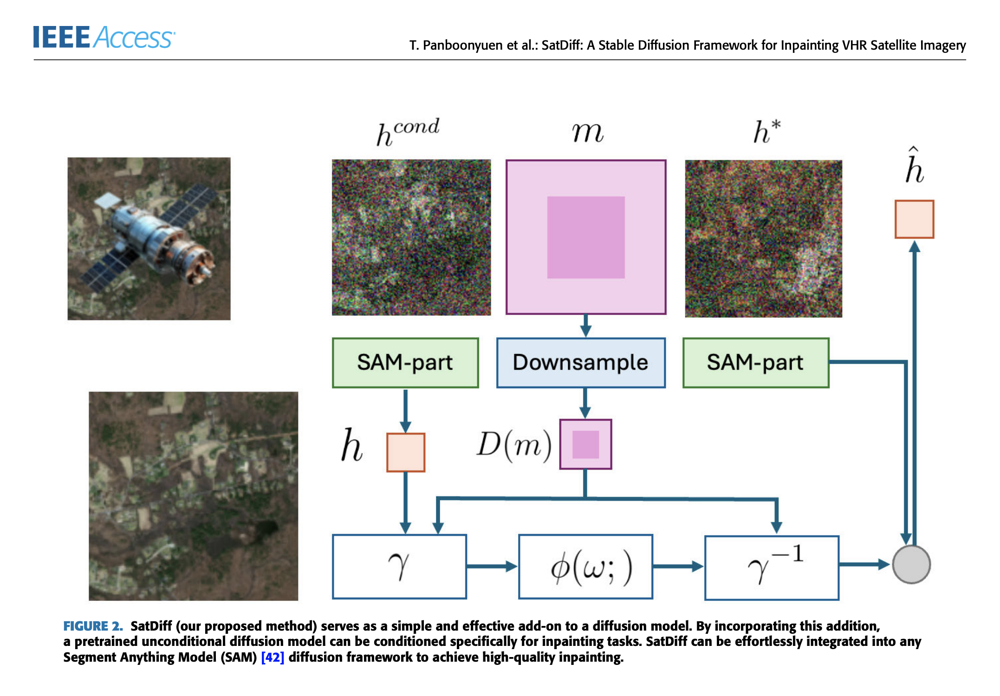

# SatDiff: A Stable Diffusion Framework for Inpainting Very High-Resolution Satellite Imagery

[](LICENSE)

**Author**: Teerapong Panboonyuen (also known as Kao Panboonyuen)  
**Project**: [SatDiff: A Stable Diffusion Framework for Satellite Image Inpainting](https://github.com/kaopanboonyuen/SatDiff)  
**Publication**: [SatDiff: A Stable Diffusion Framework for Inpainting Very High-Resolution Satellite Imagery](https://ieeexplore.ieee.org/document/10929005), IEEE International Geoscience and Remote Sensing Symposium (IGARSS), 2024

---

## Abstract

High-resolution satellite imagery plays a critical role in numerous geospatial applications, yet such data often suffers from occlusions (e.g., cloud cover, sensor gaps) that hinder downstream tasks. We propose **SatDiff**, a novel generative AI framework based on Stable Diffusion tailored for **inpainting missing regions** in **very high-resolution satellite imagery**. Unlike conventional image completion models, SatDiff is designed to preserve both **semantic consistency** and **fine structural detail**—key requirements in remote sensing analysis.

The SatDiff framework introduces a **dual-branch attention-enhanced architecture** and a **diffusion-driven training pipeline**, enabling more coherent and visually accurate reconstructions. Our extensive evaluation on multiple remote sensing datasets demonstrates that SatDiff outperforms state-of-the-art methods, offering significant improvements in PSNR, SSIM, and visual realism.

---

## 🔍 Key Features

- 🌐 **Stable Diffusion Backbone**: Utilizes the power of latent diffusion to generate semantically consistent inpainting results in satellite images.
- 🧠 **Dual-Branch Architecture**: Combines high-frequency detail extraction and contextual understanding for improved fidelity.
- ⚡ **Attention Mechanisms**: Integrates cross- and self-attention layers to enhance long-range feature coherence.
- 📈 **State-of-the-Art Results**: Achieves superior performance in PSNR, SSIM, and perceptual quality on high-resolution satellite datasets.

---

## 🏗️ Architecture Overview

<p align="center">
  
</p>

<p align="center">
  
</p>

<p align="center">
  
</p>

---

## 📦 Installation

Clone the repository and install the dependencies:

```bash
git clone https://github.com/kaopanboonyuen/SatDiff.git
cd SatDiff
pip install -r requirements.txt
````

We recommend using a Python environment with CUDA for GPU acceleration.

---

## 🚀 Usage

1. **Prepare Dataset**: Organize your dataset following the instructions in `docs/dataset_prep.md`.
2. **Configure Settings**: Modify the `src/config.yaml` file with paths, model parameters, and training options.
3. **Training**:

   ```bash
   python src/train.py
   ```
4. **Evaluation**:

   ```bash
   python src/evaluate.py
   ```
5. **Inference**:

   ```bash
   python src/inference.py --image_path path/to/image.png
   ```

---

## 🛰️ Example Results

<p align="center">
  
</p>

SatDiff reconstructs occluded areas with high spatial accuracy and realistic texture synthesis.

---

## 🧑‍🔬 Author Bio

<p align="center">
  
</p>

Teerapong Panboonyuen (Kao) is a researcher in AI for Earth Observation and Geospatial Data Science. His works focus on deep learning applications for satellite image understanding, including semantic segmentation, inpainting, and domain adaptation.

---

## 🌍 Project Website

For more insights, visit the [project page](https://kaopanboonyuen.github.io/SatDiff) *(Coming Soon)*.

---

## 📖 Citation

If you use SatDiff in your research, please cite:

```bibtex
@inproceedings{panboonyuen2024satdiff,
  title={SatDiff: A Stable Diffusion Framework for Inpainting Very High-Resolution Satellite Imagery},
  author={Panboonyuen, Teerapong and [Other Authors]},
  booktitle={2024 IEEE International Geoscience and Remote Sensing Symposium (IGARSS)},
  year={2024},
  organization={IEEE}
}
```

---

## 📄 License

This project is licensed under the MIT License. See the [LICENSE](LICENSE) file for details.

---

## 🙏 Acknowledgments

We thank our collaborators and the remote sensing research community for their valuable feedback. SatDiff builds upon the recent advancements in generative diffusion models, specifically adapting them for the demands of Earth observation.

For questions, issues, or contributions, feel free to open an issue or submit a pull request. Your interest in our work is greatly appreciated!

---
